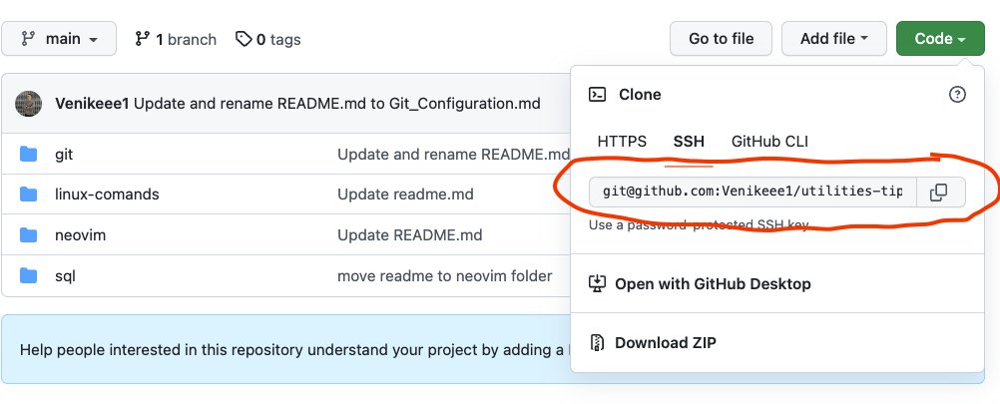

## Git Basics

### Initializing a Repository in an Existing Directory
```
git init 
```

### Cloning
```
git clone <repository-link> <dir-name>
```

`<dir-name>` is an optional param. If provided git clones repository in this folder

You can get `<repository-link>` for any public repo from here 


### File states

### Checking the Status of Your Files
```
git status
```
### Stage files
```
git add <file-name>
```
Multiple Files could be passed one after another devided by space.
You can path `.` sign that means stage all changed files 

### Diff
shows changed files but not staged
```
git diff
```
shows staged diff
```
git diff --staged
```
### Commiting changes
```
git commit -m "some massage"
```

`-a` flag tells git to combine staging phase and commiting phase. It could looks like this `git commit -ma "some message"` 
### Removing Files
To remove a file from Git, you have to remove it from your tracked files (more accurately, remove it from your staging area) and then commit. The git rm command does that, and also removes the file from your working directory so you don’t see it as an untracked file the next time around.

If you simply remove the file from your working directory, it shows up under the “Changes not staged for commit” (that is, unstaged) area of your git status output
```
git rm <file-name>
```
The next time you commit, the file will be gone and no longer tracked. If you modified the file or had already added it to the staging area, you must force the removal with the `-f` option. This is a safety feature to prevent accidental removal of data that hasn’t yet been recorded in a snapshot and that can’t be recovered from Git.
