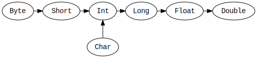

## Types

`Any` is the supertype of all types, also called the top type. It defines certain universal methods such as `equals`, `hashCode`, and `toString`. `Any` has two direct subclasses: `AnyVal` and `AnyRef`.

There are nine predefined value types and they are non-nullable: `Double`, `Float`, `Long`, `Int`, `Short`, `Byte`, `Char`, `Unit`, and `Boolean`.

- `Unit` - is a value type which carries no meaningful information. It is used similarly to `void` in Java and C

### Type casting



## Defining Methods

`def` - is a key word for defining method i.e:

``` scala
def addThenMultiply(x: Int, y: Int)(multiplier: Int): Int = (x + y) * multiplier

def getSquareString(input: Double): String =
  val square = input * input
  square.toString
```
> **Note** The last expression in the body is the method’s return value. (Scala does have a `return` keyword, but it is rarely used.)

## Classes

### Defining Class

You can define classes with the class keyword, followed by its name and constructor parameters:

``` scala
class Greeter(prefix: String, suffix: String):
  def greet(name: String): Unit =
    println(prefix + name + suffix)
```

### Case Classes 
Scala has a special type of class called a “case” class. Byo default, instances of case classes are immutable, and they are compared by value (unlike classes, whose instances are compared by reference). This makes them additionally useful for [pattern matching](https://docs.scala-lang.org/tour/pattern-matching.html#matching-on-case-classes).

``` scala
case class Point(x: Int, y: Int)
```

### Objects
Objects are single instances of their own definitions. You can think of them as singletons of their own classes.

``` scala
object IdFactory:
  private var counter = 0
  def create(): Int =
    counter += 1
    counter

val newId: Int = IdFactory.create()
println(newId) // 1
val newerId: Int = IdFactory.create()
println(newerId) // 2
```

### Traits
Traits are abstract data types containing certain fields and methods. In Scala inheritance, a class can only extend one other class, but it can extend multiple traits.

You can define traits with the trait `keyword`:

``` scala
trait Greeter:
  def greet(name: String): Unit
```

### Program Entry Point

The main method is the entry point of a Scala program. The Java Virtual Machine requires a main method, named main, that takes one argument: an array of strings. In Scala 3, with the @main annotation, a main method is automatically generated from a method as follows:

``` scala
@main def hello() = println("Hello, Scala developer!")
```


